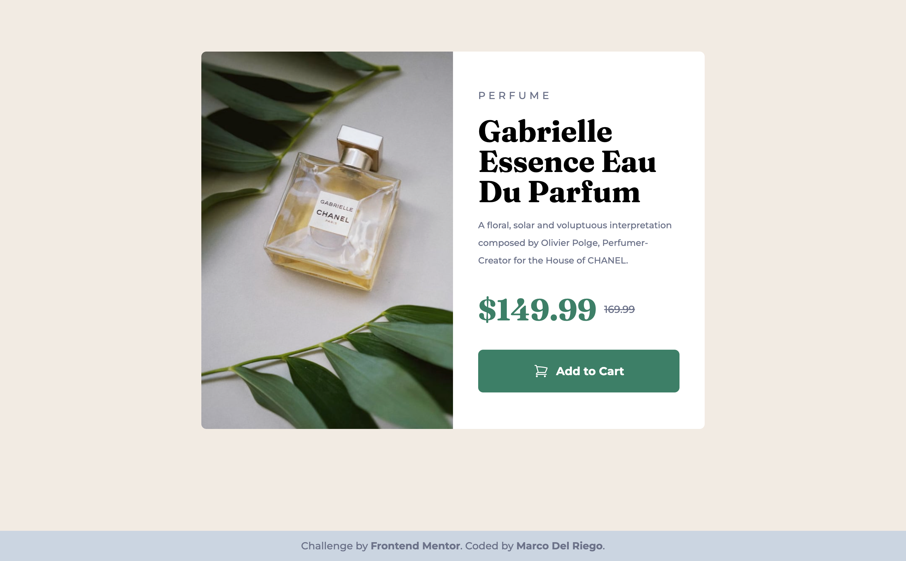

# Frontend Mentor - Product preview card component solution

This is a solution to the [Product preview card component challenge on Frontend Mentor](https://www.frontendmentor.io/challenges/product-preview-card-component-GO7UmttRfa). Frontend Mentor challenges help you improve your coding skills by building realistic projects. 

## Table of contents

- [Overview](#overview)
  - [The challenge](#the-challenge)
  - [Screenshot](#screenshot)
  - [Links](#links)
  - [Built with](#built-with)
  - [Continued development](#continued-development)
  - [Useful resources](#useful-resources)
- [Author](#author)

## Overview

### The challenge

Users should be able to:

- View the optimal layout depending on their device's screen size
- See hover and focus states for interactive elements

### Screenshot

### Links

- Solution URL: [Add solution URL here](https://github.com/Relmaur/FM-product-preview-card-component)
- Live Site URL: [Add live site URL here](https://fm-product-preview-card-component-gamma.vercel.app/)

### Built with

- Semantic HTML5 markup
- [Tailwindcss](https://tailwindcss.com/) (of course)
- Mobile-first workflow

### Continued development

I will continue in responsive web development, by mastering both Tailwindcss and Sass, which are my preferred styling choices...

### Useful resources

- [Tailwind Docs](https://tailwindcss.com/) - Well, who doesn't have a toolset documentation at hand at any moment, huh?.
- [The Always Amazing W3Schools](https://www.w3schools.com/) - I don't always remember how to center a friggin div!.

## Author

- Website - [Marco Del Riego](https://www.marcolizardo.com)
- Frontend Mentor - [@Relmaur](https://www.frontendmentor.io/profile/Relmaur)
- LinkedIn - [Profile](https://www.linkedin.com/in/marco-del-riego/)

